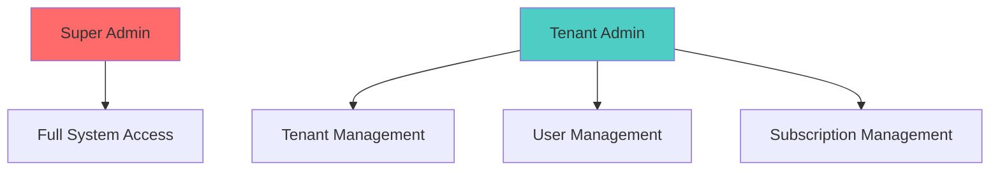
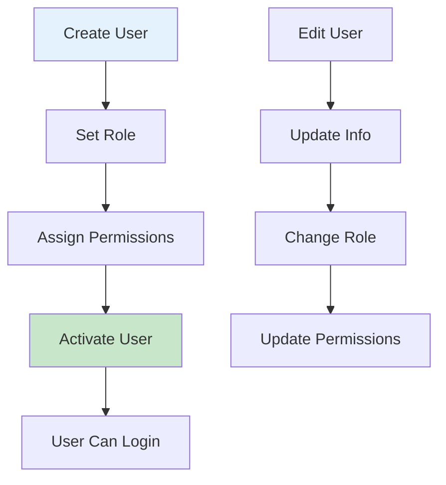
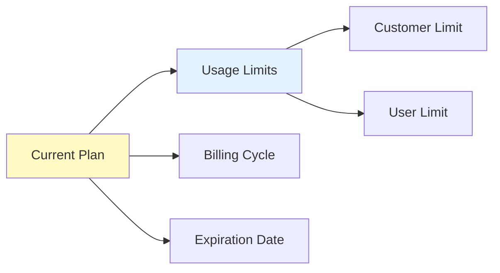
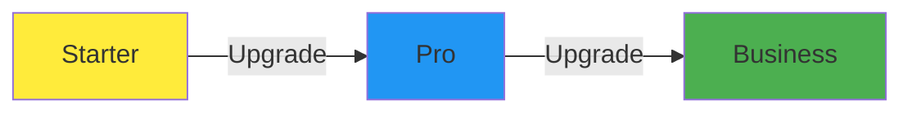
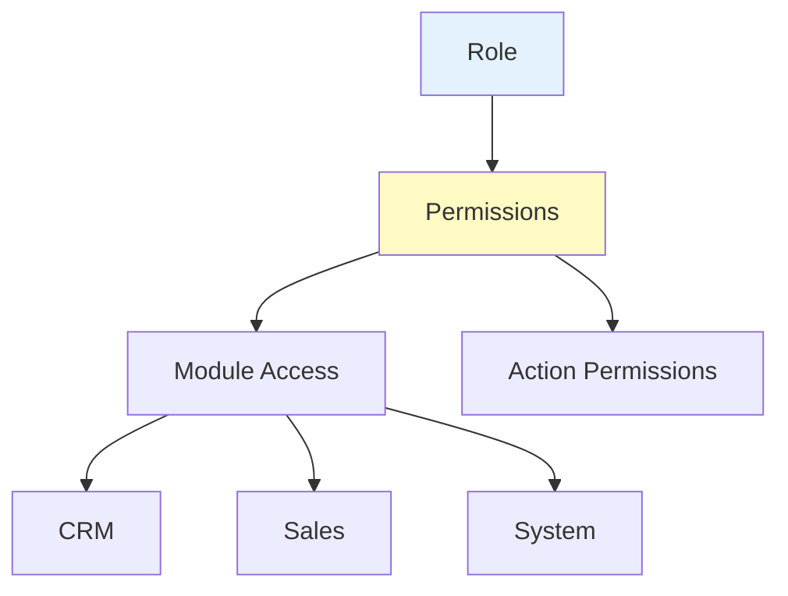

# Administrator Guide

Comprehensive guide for administrators and tenant administrators managing TinyCRM.

## Table of Contents

1. [Administrator Overview](#administrator-overview)
2. [User Management](#user-management)
3. [Subscription Management](#subscription-management)
4. [File Management](#file-management)
5. [Permission & Role Management](#permission--role-management)
6. [System Configuration](#system-configuration)
7. [Audit Logs](#audit-logs)

---

## Administrator Overview

Administrators have access to additional features for managing the organization, users, and system settings.

### Administrator Roles



| Role | Permissions | Scope |
|------|-------------|-------|
| **Super Admin** | Full system access | All tenants |
| **Tenant Admin** | Tenant management | Own tenant only |
| **Regular User** | Standard CRM features | Assigned leads/customers |

### Administrator Dashboard

Administrators see additional statistics and management options:

```
┌─────────────────────────────────────────────┐
│  Admin Dashboard                            │
├─────────────────────────────────────────────┤
│  👥 Total Users: 25                         │
│  🏢 Active Tenants: 10                      │
│  💳 Active Subscriptions: 8                 │
│  📊 System Usage Statistics                 │
│  ⚠️  Pending Actions                        │
└─────────────────────────────────────────────┘
```

---

## User Management

Manage users within your tenant, including creating, editing, and assigning roles.

### User Management Workflow



### Creating a New User

1. Navigate to **System → Users**
2. Click **Create User**
3. Fill in user information:
   - **Username**: Unique username (usually email)
   - **Email**: User's email address
   - **Name**: Display name
   - **Password**: Initial password (user can change later)
   - **Phone**: Contact phone (optional)
   - **Role**: Select user role
4. Click **Save**

> 💡 **Note**: The user will receive an email invitation (if email service is configured).

### User Roles

| Role | Description | Permissions |
|------|-------------|-------------|
| **Admin** | Tenant administrator | Full tenant access, user management, subscription management |
| **User** | Regular user | Access to assigned leads, customers, invoices |

### Managing Users

#### Viewing Users

1. Go to **System → Users**
2. Use filters to find users:
   - Name
   - Email
   - Role
   - Status (Active/Disabled)

#### Editing Users

1. Open a user from the user list
2. Click **Edit**
3. Update information:
   - Personal details
   - Password (optional)
   - Role (admins only)
   - Status
4. Click **Save**

> ⚠️ **Warning**: Changing a user's role may affect their permissions. Review role permissions before making changes.

#### Assigning Roles

1. Open a user
2. Click **Assign Roles**
3. Select roles from available list
4. Click **Save**

> 💡 **Note**: Users can have multiple roles. Permissions are cumulative.

#### Disabling Users

1. Open a user
2. Click **Edit**
3. Change **Status** to **Disabled**
4. Click **Save**

> ✅ **Effect**: Disabled users cannot log in but their data is preserved.

### User Invitations

Invite new users via email:

1. Navigate to **System → Users**
2. Click **Invite User**
3. Enter email address
4. Select role
5. Click **Send Invitation**

The user will receive an email with:
- Invitation link
- Temporary access credentials
- Instructions to set up their account

---

## Subscription Management

Manage your organization's subscription plan, billing, and usage limits.

### Subscription Overview



### Viewing Subscription

1. Navigate to **System → Subscription**
2. View current subscription details:
   - **Plan**: Current plan (Starter, Pro, Business)
   - **Status**: Active, Trialing, Expired, Canceled
   - **Billing Cycle**: Monthly or Yearly
   - **Start Date**: Subscription start date
   - **End Date**: Subscription expiration date
   - **Usage**: Current usage vs. limits

### Subscription Plans

| Plan | Features | Limits |
|------|----------|--------|
| **Starter** | Basic CRM features | Lower customer/user limits |
| **Pro** | Advanced features | Higher limits, priority support |
| **Business** | Full feature access | Maximum limits, dedicated support |

### Subscription Status

| Status | Description | Actions Available |
|--------|-------------|-------------------|
| **Trialing** | Free trial period | Upgrade, Subscribe |
| **Active** | Active subscription | Upgrade, Renew, View |
| **Expired** | Subscription expired | Renew, Subscribe |
| **Canceled** | Subscription canceled | Subscribe (new) |

### Upgrading Subscription

1. Go to **System → Subscription**
2. Click **Upgrade**
3. Select new plan
4. Review pricing and features
5. Confirm upgrade

> 💡 **Note**: Upgrades take effect immediately. You'll be charged the prorated difference.

### Upgrade Rules



**Important Rules:**
- ✅ Upgrades are allowed at any time
- ✅ Permissions take effect immediately
- ✅ Expiration date remains unchanged
- ❌ Downgrades are not allowed
- ❌ Users cannot cancel (contact support)

### Subscription Renewal

1. Navigate to **System → Subscription**
2. View expiration date
3. Before expiration, click **Renew**
4. Select billing cycle (Monthly/Yearly)
5. Complete payment

> ⚠️ **Warning**: If subscription expires, some features may be limited until renewal.

### Usage Monitoring

Monitor your subscription usage:

```
Subscription Usage:
┌─────────────────────────┐
│ Customers: 45 / 100      │ ████████░░ 45%
│ Users: 8 / 20           │ ████████░░ 40%
│ Storage: 2.5GB / 10GB   │ ████░░░░░░ 25%
└─────────────────────────┘
```

**Usage Alerts:**
- System alerts when approaching limits
- Warnings at 80% usage
- Critical alerts at 95% usage

---

## File Management

Manage files and documents stored in the system.

### File Storage

Files are stored in Object Storage Service (OSS) and organized by:
- **Tenant**: Files are tenant-scoped
- **Category**: File type/category
- **Upload Date**: Chronological organization

### Uploading Files

1. Navigate to **System → Files**
2. Click **Upload File**
3. Select file(s) from your computer
4. Add description (optional)
5. Click **Upload**

**Supported File Types:**
- Documents: PDF, DOC, DOCX, XLS, XLSX
- Images: JPG, PNG, GIF
- Archives: ZIP, RAR

### Managing Files

#### Viewing Files

1. Go to **System → Files**
2. Browse files by:
   - Date
   - Type
   - Size
   - Uploader

#### Downloading Files

1. Find the file in the list
2. Click **Download**
3. File downloads to your computer

#### Deleting Files

1. Open file details
2. Click **Delete**
3. Confirm deletion

> ⚠️ **Warning**: Deleted files cannot be recovered.

### File Permissions

Files inherit tenant permissions:
- **Tenant Admin**: Full access to all tenant files
- **Regular Users**: Access to files they uploaded or were shared with them

---

## Permission & Role Management

Configure roles and permissions for fine-grained access control.

### Role System



### Creating Roles

1. Navigate to **System → Roles** (if available)
2. Click **Create Role**
3. Enter role details:
   - **Name**: Role name
   - **Description**: Role description
4. Assign permissions:
   - Select modules
   - Select actions (View, Create, Update, Delete)
5. Click **Save**

### Permission Types

| Permission | Description |
|------------|-------------|
| **View** | Can view records |
| **Create** | Can create new records |
| **Update** | Can edit existing records |
| **Delete** | Can delete records |
| **Manage** | Full access (all above) |

### Default Roles

| Role | Default Permissions |
|------|---------------------|
| **Admin** | Full access to all modules |
| **User** | View and manage assigned leads/customers |

### Assigning Roles to Users

1. Open a user
2. Click **Assign Roles**
3. Select one or more roles
4. Click **Save**

> 💡 **Note**: Users with multiple roles get the union of all permissions.

---

## System Configuration

Configure system-wide settings and preferences.

### Tenant Settings

Manage organization-level settings:

1. Navigate to **System → Settings** (if available)
2. Configure:
   - **Organization Name**: Display name
   - **Contact Information**: Email, phone
   - **Address**: Business address
   - **Tax Information**: Tax ID, etc.

### System Preferences

Configure system behavior:

- **Date Format**: How dates are displayed
- **Time Zone**: System time zone
- **Currency**: Default currency
- **Language**: Interface language

### Auto-Recycle Settings

Configure automatic lead recycling:

1. Go to **System → Settings**
2. Find **Auto-Recycle Clue** setting
3. Enable/disable auto-recycle
4. Set recycling rules:
   - Days before recycling
   - Conditions for recycling
5. Click **Save**

> 💡 **Note**: Auto-recycle returns unclaimed leads to the Lead Pool after a specified period.

---

## Audit Logs

Track all system changes and user activities.

### Viewing Audit Logs

1. Navigate to **System → Audit Logs**
2. Filter logs by:
   - **User**: Who made the change
   - **Action**: What action was performed
   - **Model**: What entity was changed
   - **Date Range**: When it happened

### Audit Log Information

Each log entry contains:
- **Timestamp**: When the action occurred
- **User**: Who performed the action
- **Action**: Type of action (Create, Update, Delete)
- **Model**: Entity type (Company, Invoice, User, etc.)
- **Changes**: What was changed (before/after values)

### Audit Log Types

| Type | Description |
|------|-------------|
| **Create** | New record created |
| **Update** | Existing record modified |
| **Delete** | Record deleted |
| **Login** | User login events |
| **Permission** | Permission changes |

### Exporting Audit Logs

1. Go to **System → Audit Logs**
2. Apply filters (optional)
3. Click **Export**
4. Choose format (CSV, Excel)
5. Download file

---

## Best Practices

### User Management

1. **Regular Review**: Periodically review user access and permissions
2. **Role-Based Access**: Use roles instead of individual permissions
3. **Disable, Don't Delete**: Disable users instead of deleting to preserve history
4. **Documentation**: Document custom roles and their purposes

### Subscription Management

1. **Monitor Usage**: Regularly check usage against limits
2. **Plan Ahead**: Upgrade before hitting limits
3. **Renewal Reminders**: Set reminders for subscription renewal
4. **Cost Optimization**: Choose appropriate plan for your needs

### Security

1. **Strong Passwords**: Enforce strong password policies
2. **Regular Audits**: Review audit logs regularly
3. **Access Control**: Follow principle of least privilege
4. **User Training**: Ensure users understand security practices

### System Maintenance

1. **Regular Backups**: Ensure regular data backups
2. **Update Management**: Keep system updated
3. **Performance Monitoring**: Monitor system performance
4. **Documentation**: Keep system documentation current

---

## Troubleshooting

### Common Issues

**Q: I can't create new users**
- **A**: Check subscription user limit. You may need to upgrade your plan.

**Q: Subscription upgrade not working**
- **A**: Ensure payment method is valid. Contact support if issues persist.

**Q: Users can't access certain features**
- **A**: Check user roles and permissions. Ensure roles have required permissions.

**Q: Files not uploading**
- **A**: Check file size limits and storage quota. Verify file type is supported.

**Q: Audit logs missing**
- **A**: Audit logging may be disabled. Check system settings.

---

## Additional Resources

- [User Guide](user-guide.md) - Standard user features
- [Quick Start Guide](quick-start.md) - Getting started
- [Subscription Guide](subscription.md) - Detailed subscription information
- [FAQ](faq.md) - Frequently asked questions

---

*Last Updated: January 2025*
